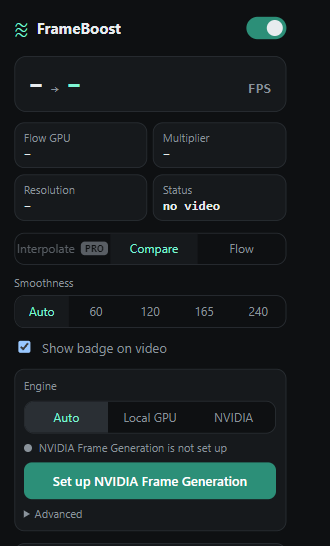
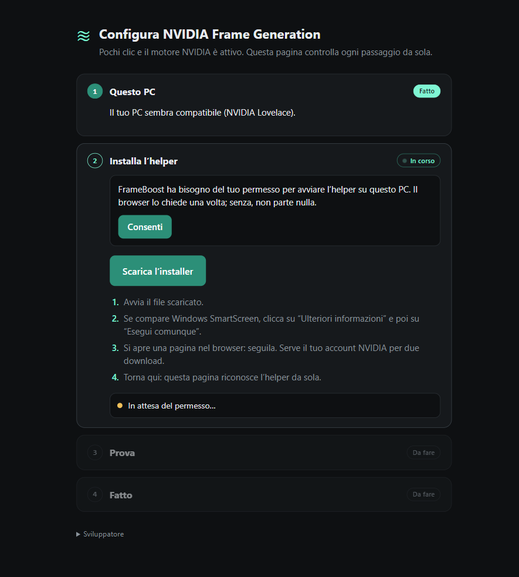
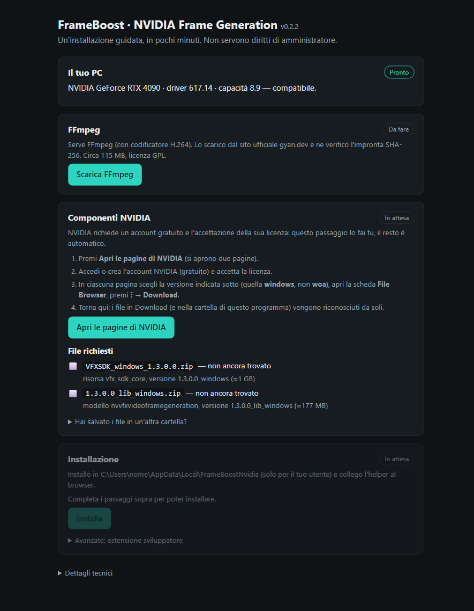
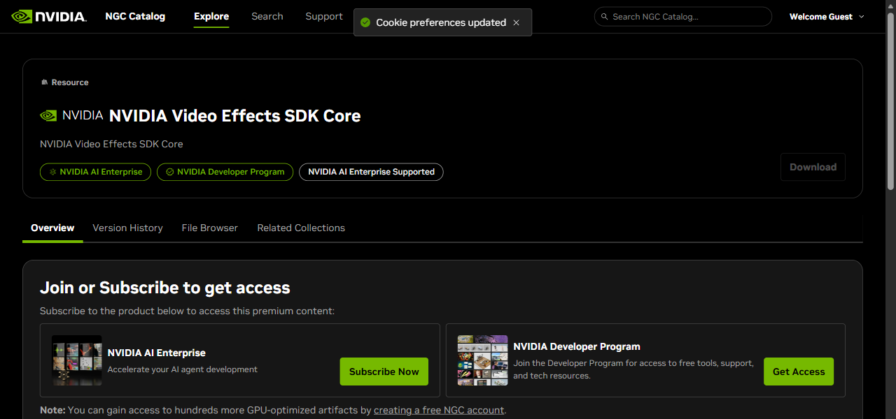
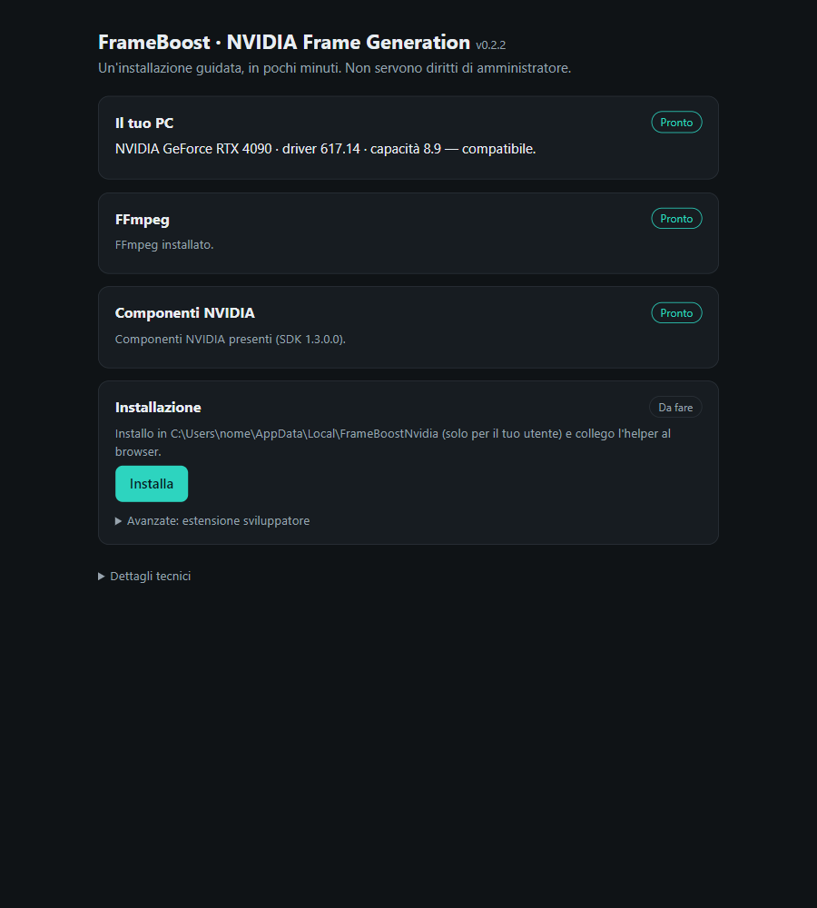
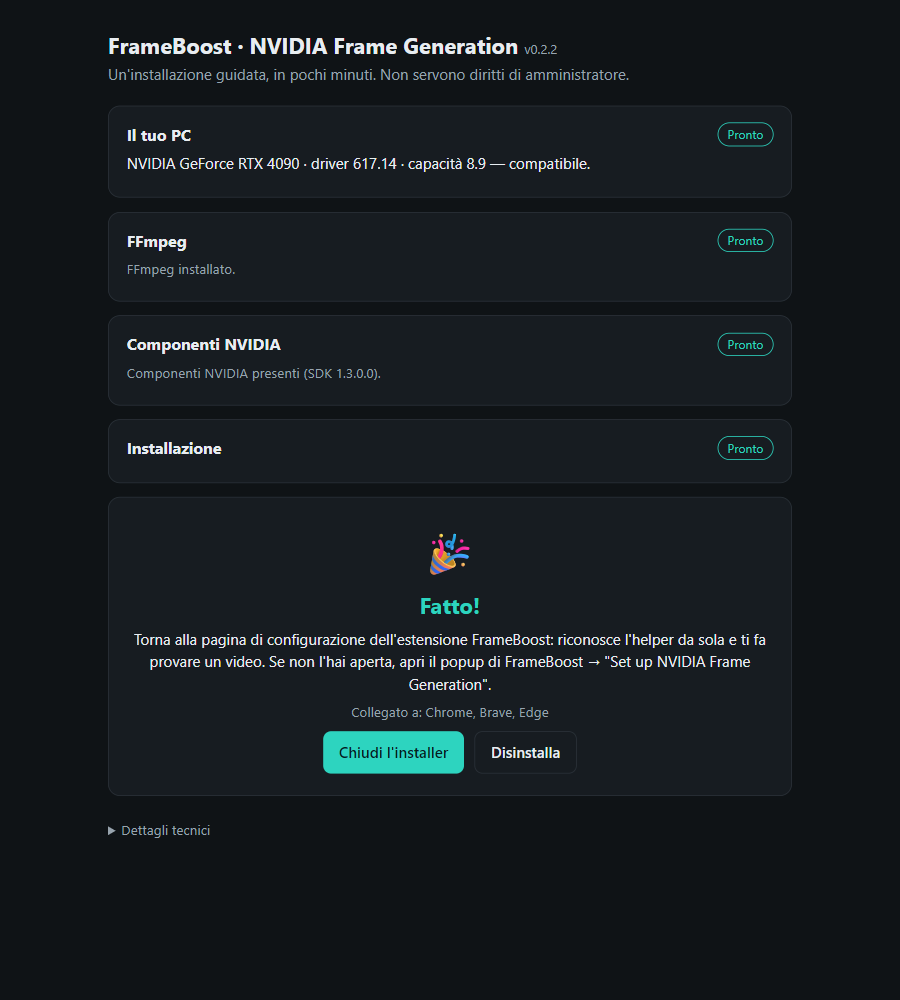
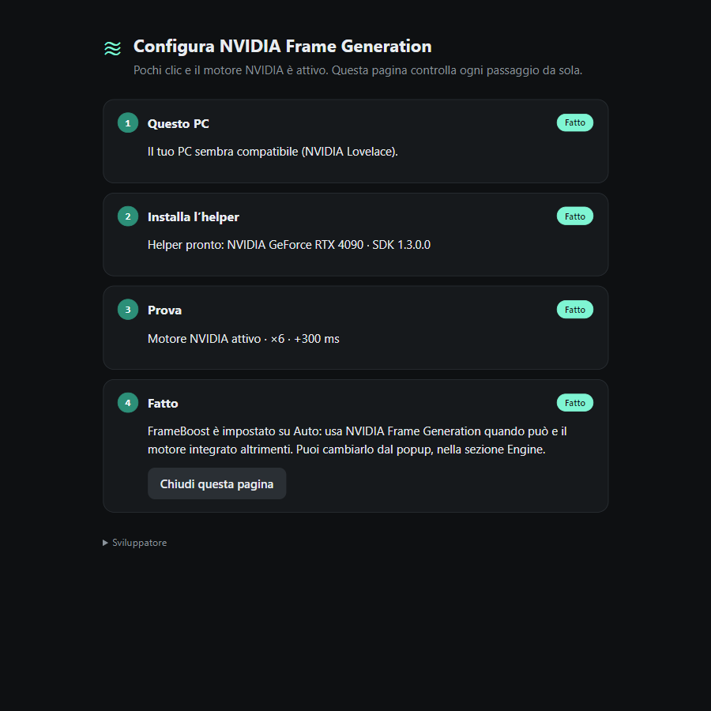
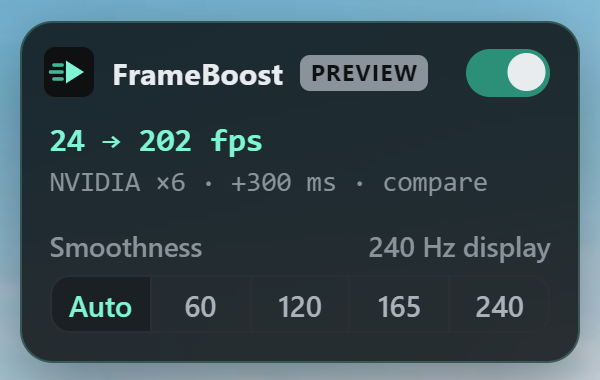

# Guida: NVIDIA Frame Generation in FrameBoost

> English version: [GUIDE.md](GUIDE.md) · 🎬 Video con tutti i passaggi: [guide-it.mp4](guide-it.mp4)

**Serve:** Windows 10/11, scheda **NVIDIA RTX 40 o 50**, driver **570.65 o più recente**, un **account NVIDIA gratuito**, il browser con l'estensione FrameBoost. Circa 10-15 minuti.

Non devi copiare token né toccare file: il resto lo fa il programma di installazione.

## 1 · Apri FrameBoost

Clicca l'icona di FrameBoost nel browser e premi **Set up NVIDIA Frame Generation**.

## 2 · Consenti

Nella pagina che si apre premi **Consenti**. Il browser chiede il permesso una sola volta (serve solo ad avviare l'helper sul tuo PC). Dopo il consenso la pagina dice «Sto completando la configurazione…»: **attendi circa 30 secondi**, va avanti da sola.

## 3 · Scarica e avvia l'installer

Premi **Scarica l'installer** (file `FrameBoost-NVIDIA-Setup.exe`, ~90 MB, anche nella pagina [Releases](../../../releases/latest)) e avvialo.

- Se Windows **SmartScreen** avvisa: **Ulteriori informazioni → Esegui comunque**. Il file non è firmato digitalmente.
- Si apre una pagina nel browser con quattro passaggi. Il primo controlla il PC; se manca **FFmpeg** premi **Scarica FFmpeg** (circa 115 MB, dal sito ufficiale, con controllo dell'impronta SHA-256).

## 4 · Account e file NVIDIA

NVIDIA non permette di ridistribuire il suo SDK, quindi questo passaggio lo fai tu (una volta sola):

1. Nell'installer premi **Apri le pagine di NVIDIA**: si aprono due pagine del catalogo NGC.
2. **Accedi o crea l'account gratuito** (con «Get Access» / «Log In») e accetta la licenza.
3. In **ciascuna** delle due pagine apri la scheda **File Browser**, premi il **menu a tre puntini** accanto al file → **Download**.
4. Scarica i file **windows**, **non** quelli **woa** (Windows su ARM, non funzionano su un PC normale):
   - `VFXSDK_windows_1.3.0.0.zip` (≈ 1 GB)
   - `1.3.0.0_lib_windows.zip` (≈ 177 MB)

Salvali nella cartella **Download** (o nella cartella dell'installer): l'installer li riconosce e li scompatta da solo. Se li hai salvati altrove, apri «Hai salvato i file in un'altra cartella?» e incolla il percorso.

## 5 · Installa

Quando tutti i riquadri sono **Pronto** premi **Installa**. L'installazione è solo per il tuo utente (nessun diritto di amministratore) e collega l'helper a Chrome, Brave, Edge.

## 6 · Fatto

## 7 · Torna in FrameBoost

La pagina dell'estensione riconosce l'helper da sola. Apri un video (anche quello di prova): il motore NVIDIA parte da solo.

## 8 · Funziona

Sul video compare il badge di FrameBoost: **NVIDIA ×N** mostra il motore e il moltiplicatore, **+300 ms** è il ritardo con cui il video viene mostrato per dare tempo ai fotogrammi generati. L'**audio viene ritardato dello stesso valore**, quindi resta sincronizzato. Se il badge dice «audio not synced», clicca una volta sulla pagina (il browser avvia l'audio solo dopo un'interazione).

---

## Se qualcosa non va

| Problema | Cosa fare |
| --- | --- |
| L'installer non vede i file | Controlla che si chiamino `VFXSDK_windows_…` e `…_lib_windows…` (non **woa**). Mettili in **Download** o nella cartella dell'installer, oppure aggiungi la cartella dal riquadro «altra cartella». |
| «Il tuo PC non è compatibile» | Serve una RTX 40/50 e il driver 570.65+ (aggiorna da nvidia.com). |
| La pagina dell'estensione resta su «In attesa del permesso» | Premi **Consenti** e accetta la richiesta del browser. |
| Dopo il consenso resta su «Sto completando…» | Attendi fino a un minuto; se non cambia, chiudi e riapri il browser. |
| «L'helper è installato ma non è ancora pronto» | La pagina elenca cosa manca (FFmpeg, file NVIDIA…): rilancia l'installer e completa i riquadri. |
| Il video non usa NVIDIA | FrameBoost passa da solo al motore integrato se l'helper non risponde. Controlla il popup → **Engine** e il file `%LOCALAPPDATA%\FrameBoostNvidia\logs\host.log`. |

**Disinstallare:** avvia di nuovo l'installer e premi **Disinstalla** (oppure `FrameBoost-NVIDIA-Setup.exe --uninstall`).

Tutto resta sul tuo computer: l'helper ascolta solo su `127.0.0.1`.
