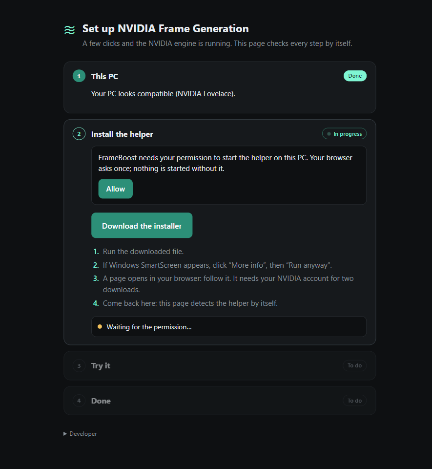
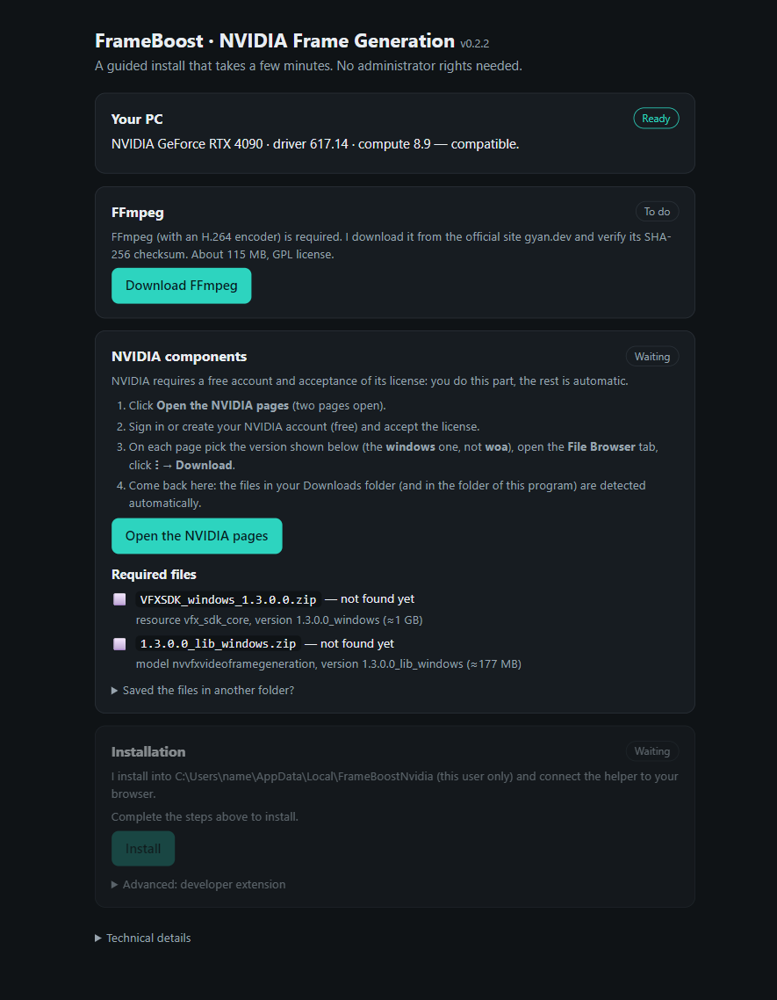
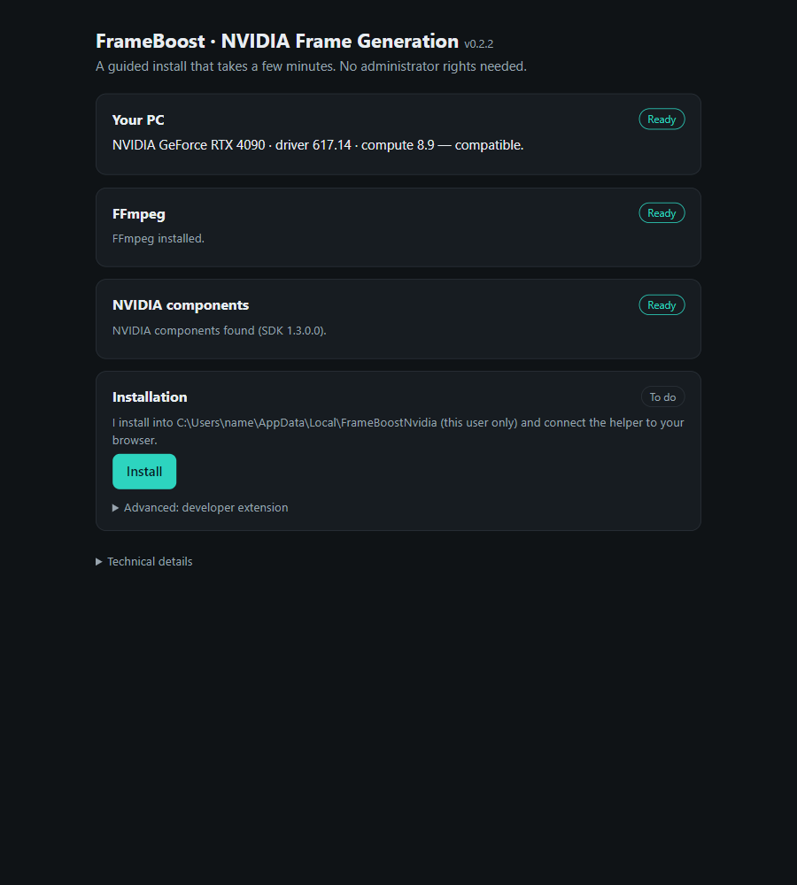
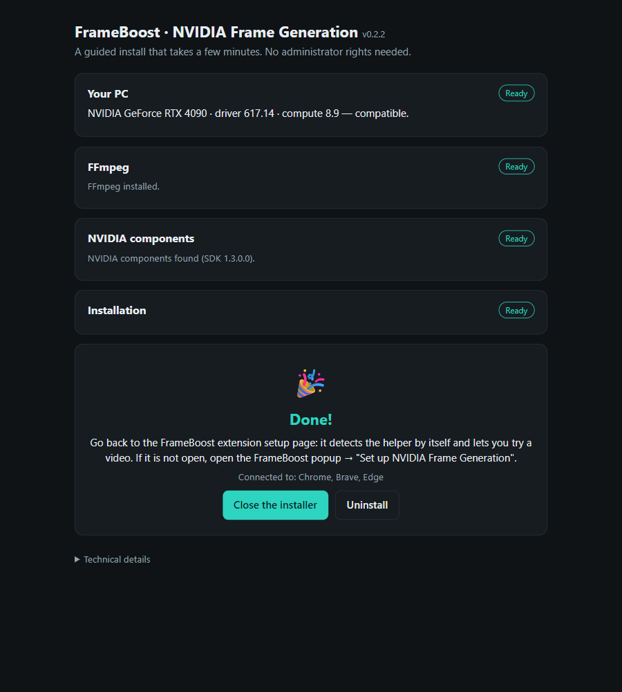
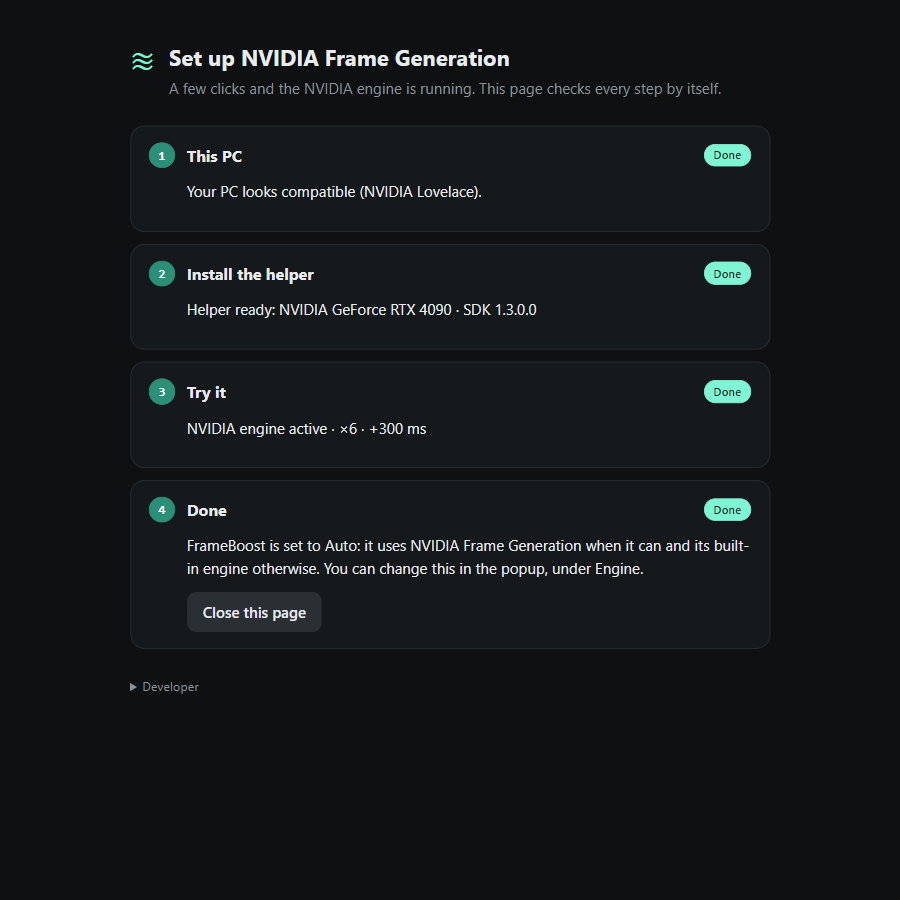
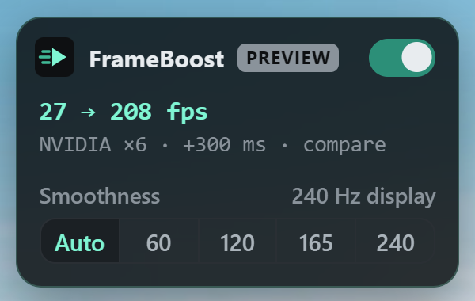

# Guide: NVIDIA Frame Generation in FrameBoost

> Versione italiana: [GUIDA.md](GUIDA.md) · 🎬 Video of every step: [guide-en.mp4](guide-en.mp4)

**You need:** Windows 10/11, an **NVIDIA RTX 40 or 50** GPU, driver **570.65 or newer**, a **free NVIDIA account**, and a browser with the FrameBoost extension. About 10-15 minutes.

There is no token to copy and no file to edit: the installer does the rest.

## 1 · Open FrameBoost

Click the FrameBoost icon in your browser and press **Set up NVIDIA Frame Generation**.

## 2 · Allow

On the page that opens press **Allow**. The browser asks for the permission once (it is only used to start the helper on your PC). After you allow it the page says "Finishing the setup…": **wait about 30 seconds**, it moves on by itself.

## 3 · Download and run the installer

Press **Download the installer** (`FrameBoost-NVIDIA-Setup.exe`, ~90 MB, also on the [Releases](../../../releases/latest) page) and run it.

- If Windows **SmartScreen** warns you: **More info → Run anyway**. The file is not code-signed.
- A page opens in your browser with four steps. The first one checks your PC; if **FFmpeg** is missing press **Download FFmpeg** (about 115 MB, from the official site, checked against its SHA-256).

## 4 · NVIDIA account and files

NVIDIA does not allow redistributing its SDK, so you do this part yourself (once):

1. In the installer press **Open the NVIDIA pages**: two NGC catalog pages open.
2. **Sign in or create the free account** ("Get Access" / "Log In") and accept the license.
3. On **each** of the two pages open the **File Browser** tab, press the **three-dot menu** next to the file → **Download**.
4. Download the **windows** files, **not** the **woa** ones (Windows on Arm: they do not work on a normal PC):
   - `VFXSDK_windows_1.3.0.0.zip` (≈ 1 GB)
   - `1.3.0.0_lib_windows.zip` (≈ 177 MB)

Save them in your **Downloads** folder (or next to the installer): the installer notices and unpacks them by itself. If you saved them elsewhere, open "Saved the files in another folder?" and paste the path.

## 5 · Install

When every card says **Ready** press **Install**. It installs for your user only (no administrator rights) and connects the helper to Chrome, Brave and Edge.

## 6 · Done

## 7 · Back in FrameBoost

The extension page detects the helper by itself. Open a video (the test one will do): the NVIDIA engine starts on its own.

## 8 · It works

The FrameBoost badge on the video shows **NVIDIA ×N** (engine and multiplier) and **+300 ms**, the delay with which the video is shown so the generated frames have time to arrive. The **audio is delayed by the same amount**, so it stays in sync. If the badge says "audio not synced", click once on the page (the browser only starts audio processing after an interaction).

---

## Troubleshooting

| Problem | What to do |
| --- | --- |
| The installer does not see the files | Check the names: `VFXSDK_windows_…` and `…_lib_windows…` (not **woa**). Put them in **Downloads** or next to the installer, or add their folder in the "another folder" box. |
| "This PC cannot run the NVIDIA engine" | You need an RTX 40/50 and driver 570.65+ (update from nvidia.com). |
| The extension page stays on "Waiting for the permission" | Press **Allow** and accept the browser prompt. |
| After allowing it stays on "Finishing the setup…" | Wait up to a minute; if nothing changes, close and reopen the browser. |
| "The helper is installed but not ready yet" | The page lists what is missing (FFmpeg, NVIDIA files…): run the installer again and complete the cards. |
| The video does not use NVIDIA | FrameBoost falls back to its built-in engine by itself if the helper does not answer. Check the popup → **Engine** and the file `%LOCALAPPDATA%\FrameBoostNvidia\logs\host.log`. |

**Uninstall:** run the installer again and press **Uninstall** (or `FrameBoost-NVIDIA-Setup.exe --uninstall`).

Everything stays on your computer: the helper only listens on `127.0.0.1`.
